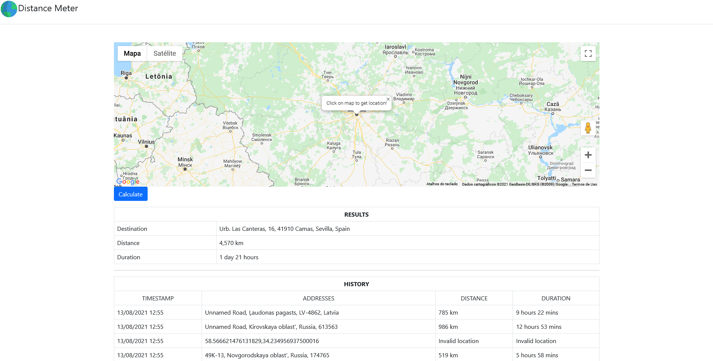

# Distance Meter



> Flask application to find the distance from the Moscow Ring Road to the specified address

### Next steps

- [x] Flask application 
- [x] Use Googlemaps API
- [x] Calculate distance between points
- [x] Documentation 

## 💻 Requirements

Before starting, make sure you have met the following requirements: 

* Most recent version of `Python`
* Python `pip` installed 
* Use  `Windows / Linux / Mac`.

## 🚀 Installing Distance_Meter

To install Distance_Meter, follow these steps: 

Clone repository:
```
git clone https://github.com/betows/Distance_Meter.git
```

Enter in the project's root folder
```
cd Distance_Meter/
```

In the project's root folder run the command to download packages:
```
pip install -r requirements.txt
```

## ☕ Using Distance_Meter

To use Distance_Meter, follow these steps:

In the project's root folder run the command to download packages:
```
python app.py
```
OR
```
flask run
```

## 📫 Contributing to Distance_Meter

To contribute to Distance_Meter, follow these steps:

1. Fork this repository.
2. Create a branch: `git checkout -b <branch_name>`.
3. Make your changes and commit them: `git commit -m '<commit_message>'`
4. Send to the original branch: `git push origin Distance_Meter / <local>`
5. Create the pull request.

Alternatively, see the GitHub documentation at [how to create a pull request](https://help.github.com/en/github/collaborating-with-issues-and-pull-requests/creating-a-pull-request ). 